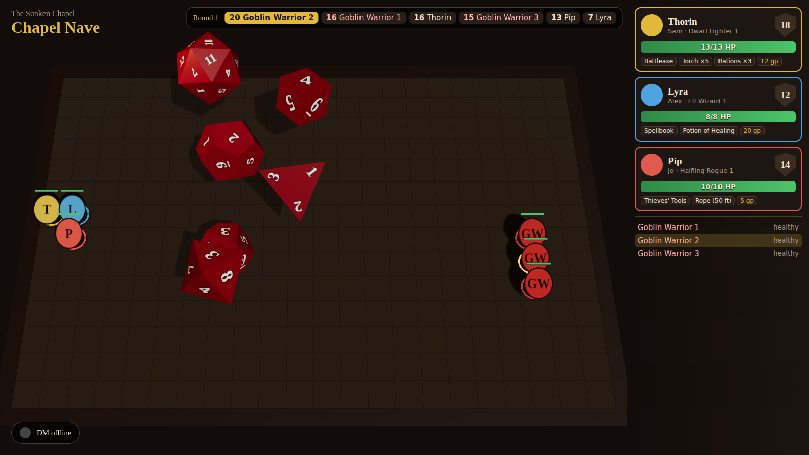

# AI Dungeon Master

An AI Dungeon Master for in-person Dungeons & Dragons (5e 2024 / SRD 5.2).

- 🗣 **Talks out loud:** OpenAI Realtime voice-to-voice. You talk to it, and you can interrupt it.
- 🎙 **Knows who's talking:** each player says their name once. After that, voiceprints identify
  speakers from a single table mic.
- 📜 **Writes the adventure:** give it an idea, and it writes the acts, locations, NPCs and
  encounters, then paints top-down maps and character and monster sprites.
- 🎲 **Rolls real 3D dice:** physics dice on the TV that always land on the server's result. Players
  can use virtual or physical dice.
- 🛡 **Tracks everything:** HP, conditions, inventory, gold, initiative and token positions, live on
  the table screen.
- 📚 **Knows the rules:** SRD 5.2.1 search plus your own house-rule files.
- 💾 **Saves and resumes:** end a session and the DM opens the next one with a "previously on…" recap.



## Quick start

```bash
pnpm install
cp .env.example .env               # add OPENAI_API_KEY (ANTHROPIC_API_KEY optional)
bash scripts/download-models.sh    # voice-ID model
pnpm build && pnpm start           # http://localhost:8787
```

- Laptop: open **http://localhost:8787/host**. Create a campaign, add players, record voices, make
  characters, then **Start voice DM**.
- TV: open **http://<laptop-ip>:8787/table**.

No keys yet? Run `pnpm --filter @dm/server seed:demo && pnpm start` for a playable demo table
(dice, tokens, combat and rules work without AI).

## Docs

Start at [docs/README.md](docs/README.md):
- [Running a session](docs/gameplay/running-a-session.md)
- [Architecture](docs/architecture/overview.md)
- [Configuration](docs/setup/configuration.md)
- [Tool catalog](docs/reference/tool-catalog.md)

## License notes

`data/srd/` contains material from the System Reference Document 5.2.1 ("SRD 5.2.1") by Wizards of
the Coast LLC, available at https://www.dndbeyond.com/srd. The SRD 5.2.1 is licensed under the
Creative Commons Attribution 4.0 International License, available at
https://creativecommons.org/licenses/by/4.0/legalcode. The Markdown conversion is from
[downfallx/dnd-5e-srd-markdown](https://github.com/downfallx/dnd-5e-srd-markdown).
